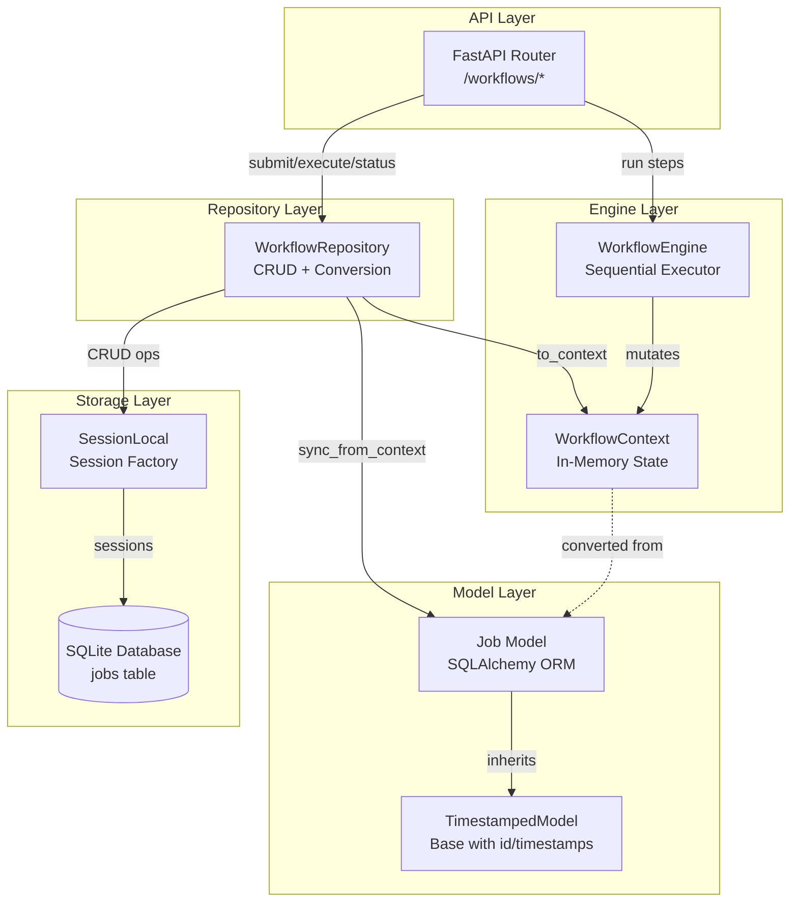
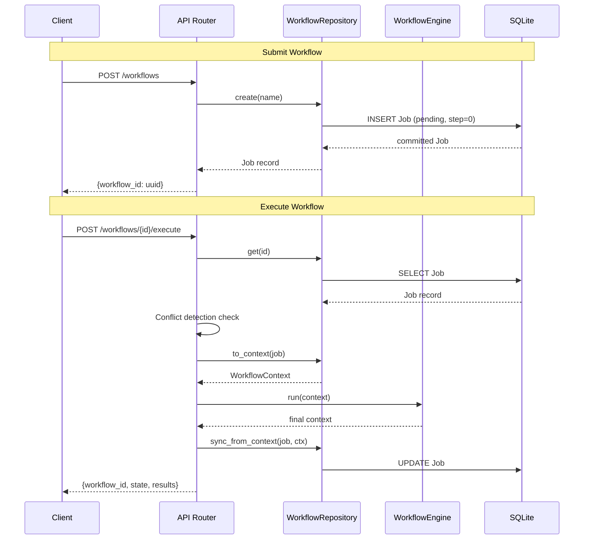
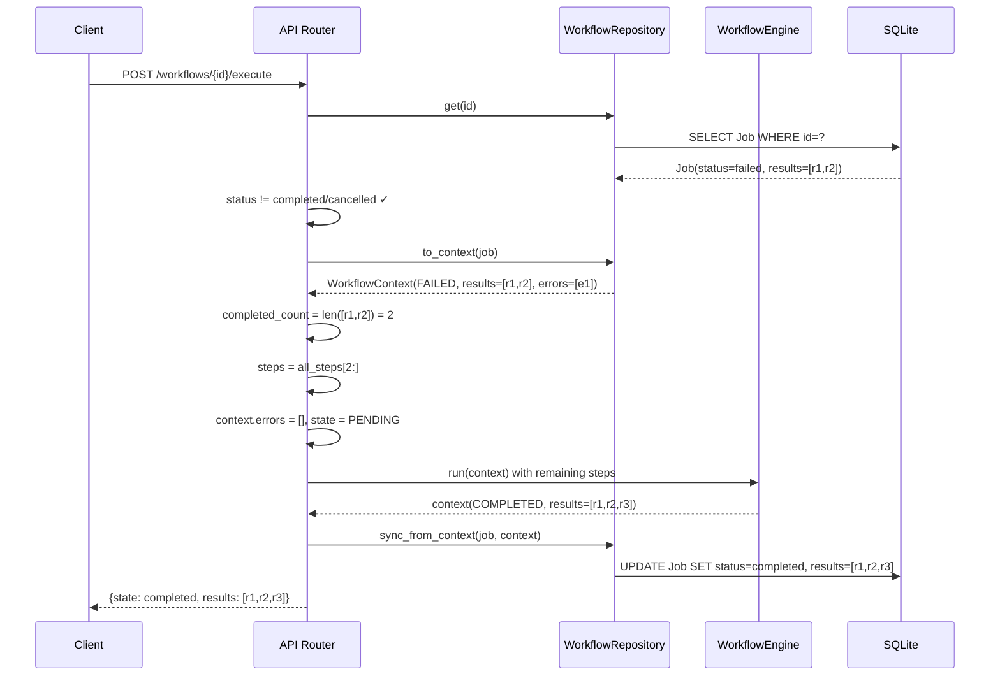
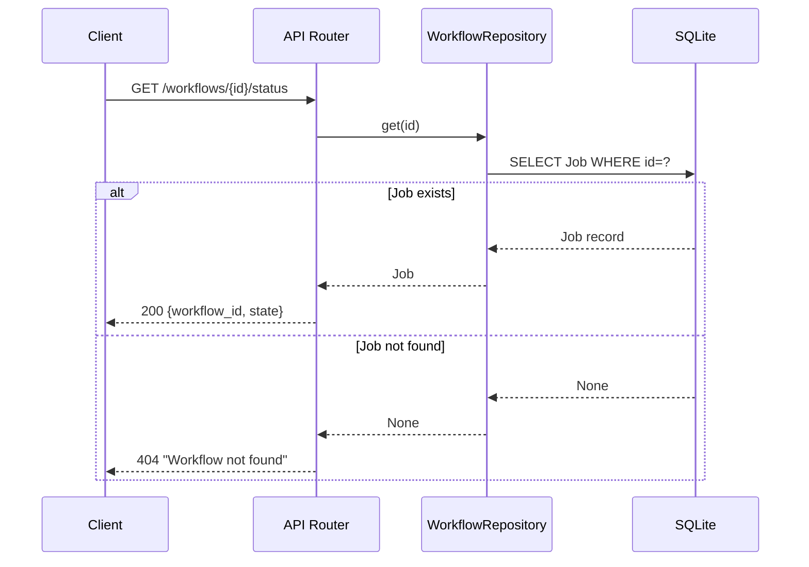

# Design Document: Workflow Persistence

## Overview

The Workflow Persistence feature provides durable storage and lifecycle management for workflow executions in AI Studio. It bridges the in-memory `WorkflowEngine` with a SQLite-backed persistence layer, enabling workflows to survive process restarts, resume from failures, and expose status via a REST API.

The system follows a layered architecture:
- **API Layer** (`app/api/router.py`) — FastAPI endpoints for submission, execution, status, and resume
- **Repository Layer** (`app/storage/workflow_repository.py`) — Data access with bidirectional model conversion
- **Model Layer** (`app/models/job.py`) — SQLAlchemy ORM with JSON serialization for structured fields
- **Engine Layer** (`app/workflows/engine.py`) — Sequential step executor operating on in-memory `WorkflowContext`

Key design decisions:
- **Separation of persistence and execution**: The engine operates on a lightweight `WorkflowContext` dataclass, unaware of the database. The repository handles conversion.
- **Lazy session management**: The repository creates DB sessions on demand, avoiding resource leaks for short-lived operations.
- **JSON-in-TEXT columns**: Results and errors are stored as JSON-serialized TEXT columns rather than normalized tables, trading query flexibility for simplicity in this sequential-step model.
- **Conflict detection at the API layer**: Terminal state checks happen before engine invocation, keeping the engine stateless.

## Architecture



### Component Interaction Flow



## Components and Interfaces

### Job Model (`app/models/job.py`)

The ORM representation of a persisted workflow execution.

```python
class Job(TimestampedModel):
    __tablename__ = "jobs"
    
    # Inherited from TimestampedModel: id, created_at, updated_at
    name: str           # Workflow name (String 255, not null)
    status: str         # WorkflowState value (String 50, default "pending")
    payload: str | None # Optional input data (Text, nullable)
    current_step: int   # Last executed step index (Integer, default 0)
    results_json: str | None  # JSON-serialized results list
    errors_json: str | None   # JSON-serialized errors list
    
    # Properties for transparent JSON serialization
    @property results -> list[Any]      # Deserializes results_json
    @property errors -> list[str]       # Deserializes errors_json
```

### WorkflowRepository (`app/storage/workflow_repository.py`)

Data access layer with lifecycle management and bidirectional conversion.

| Method | Signature | Purpose |
|--------|-----------|---------|
| `create` | `(name, payload?) -> Job` | Create a pending Job with UUID |
| `get` | `(workflow_id) -> Job \| None` | Retrieve by primary key |
| `update_state` | `(job, state, current_step?, results?, errors?) -> Job` | Persist state changes |
| `to_context` | `(job) -> WorkflowContext` | Convert Job → engine model |
| `sync_from_context` | `(job, context) -> Job` | Persist engine model → Job |
| `list_all` | `(status?) -> list[Job]` | List with optional filter |
| `close` | `() -> None` | Release DB session |

### WorkflowEngine (`app/workflows/engine.py`)

Stateless sequential executor. Takes a list of `Step` objects and a `WorkflowContext`, executes steps in order, catches exceptions per-step.

### API Router (`app/api/router.py`)

| Endpoint | Method | Purpose |
|----------|--------|---------|
| `/workflows` | POST | Create new workflow |
| `/workflows/{id}/status` | GET | Query current state |
| `/workflows/{id}/execute` | POST | Execute (or resume) workflow |

## Data Models

### Job Table Schema

| Column | Type | Constraints | Default | Description |
|--------|------|-------------|---------|-------------|
| `id` | String(36) | PRIMARY KEY | UUID v4 | Unique workflow identifier |
| `name` | String(255) | NOT NULL | — | Workflow name |
| `status` | String(50) | NOT NULL | "pending" | Current lifecycle state |
| `payload` | Text | NULLABLE | NULL | Input parameters (JSON) |
| `current_step` | Integer | NOT NULL | 0 | Index of current/last step |
| `results_json` | Text | NULLABLE | NULL | JSON array of step results |
| `errors_json` | Text | NULLABLE | NULL | JSON array of error messages |
| `created_at` | DateTime | — | utcnow() | Record creation timestamp |
| `updated_at` | DateTime | — | utcnow() | Last modification timestamp |

### WorkflowState Enum

```
pending → running → completed
                  ↘ failed → (resume) → running → completed
                  ↘ cancelled (terminal)
```

Valid transitions:
- `pending` → `running` (engine starts)
- `running` → `completed` (all steps succeed)
- `running` → `failed` (a step throws)
- `running` → `cancelled` (cancel called)
- `failed` → `pending` (resume resets state)

### Key Algorithms

#### Resume Logic

```
1. Load Job from DB by workflow_id
2. Check conflict: if status in {completed, cancelled} → 409
3. Convert Job → WorkflowContext via to_context()
4. If context.state == FAILED:
   a. completed_count = len(context.results)
   b. steps_to_run = all_steps[completed_count:]  # skip completed
   c. context.errors = []                          # clear old errors
   d. context.state = PENDING                      # reset for engine
5. Create WorkflowEngine with steps_to_run
6. engine.run(context)
7. sync_from_context(job, final_context)
```

#### Conflict Detection

```
1. Retrieve Job by ID (404 if not found)
2. If job.status == "completed" → HTTP 409 "Workflow already completed"
3. If job.status == "cancelled" → HTTP 409 "Workflow was cancelled"
4. Otherwise → proceed with execution
```

The check is performed at the API layer before any engine invocation. This ensures the engine never receives a context in a terminal state.

#### JSON Serialization (Job Model)

The `results` and `errors` properties provide transparent serialization:
- **Write**: `json.dumps(value)` → stored in `results_json`/`errors_json` TEXT column
- **Read**: `json.loads(self.results_json)` or `[]` if NULL/empty

This ensures the engine can work with native Python lists while the DB stores compact JSON strings.

### Sequence Diagrams

#### Resume Flow



#### Status Query Flow



## Correctness Properties

*A property is a characteristic or behavior that should hold true across all valid executions of a system — essentially, a formal statement about what the system should do. Properties serve as the bridge between human-readable specifications and machine-verifiable correctness guarantees.*

### Property 1: Creation Invariant

*For any* workflow name and optional payload, creating a Job via `WorkflowRepository.create()` SHALL produce a record with a valid 36-character UUID v4 identifier, status "pending", current_step 0, results equal to `[]`, and errors equal to `[]`, and that record SHALL be retrievable by its ID.

**Validates: Requirements 1.1, 1.2, 1.3**

### Property 2: JSON Serialization Round-Trip

*For any* list of JSON-serializable values assigned to `job.results` (or list of strings assigned to `job.errors`), reading back the property SHALL return a list equal to the original input.

**Validates: Requirements 2.3, 2.4**

### Property 3: State Update Persistence

*For any* valid WorkflowState, current_step integer, results list, and errors list passed to `update_state()`, re-reading the Job from the database SHALL reflect those exact values.

**Validates: Requirements 2.1**

### Property 4: Bidirectional Conversion Round-Trip

*For any* Job record with a valid WorkflowState status, converting to `WorkflowContext` via `to_context()` and syncing back via `sync_from_context()` SHALL produce a Job with equivalent status, current_step, results, and errors values.

**Validates: Requirements 3.1, 3.2, 3.3**

### Property 5: List Filtering Correctness

*For any* set of Job records with mixed statuses, calling `list_all(status=S)` SHALL return only jobs whose status equals S, and calling `list_all()` without a filter SHALL return all jobs, both ordered by created_at descending.

**Validates: Requirements 4.3, 4.4**

### Property 6: Resume Skip Correctness

*For any* failed workflow with K completed results and a pipeline of N total steps (where K < N), resuming execution SHALL execute exactly N-K steps, SHALL clear errors before execution, and SHALL reset state to pending before passing to the engine.

**Validates: Requirements 5.1, 5.2, 5.3**

### Property 7: Conflict Detection for Terminal States

*For any* workflow in a terminal state (completed or cancelled), attempting execution SHALL return HTTP 409. *For any* workflow in a non-terminal state (pending or failed), attempting execution SHALL NOT return HTTP 409.

**Validates: Requirements 6.1, 6.2, 6.3**

### Property 8: Status Endpoint Correctness

*For any* existing workflow, the status endpoint SHALL return its current workflow_id and state. *For any* non-existent workflow_id, the status endpoint SHALL return HTTP 404.

**Validates: Requirements 7.1, 7.2**

## Error Handling

| Scenario | Layer | Behavior |
|----------|-------|----------|
| Workflow not found | API Router | HTTP 404 with "Workflow not found" |
| Execute completed workflow | API Router | HTTP 409 with "Workflow already completed" |
| Execute cancelled workflow | API Router | HTTP 409 with "Workflow was cancelled" |
| Step execution failure | WorkflowEngine | Catches exception, appends to errors, sets state to FAILED, stops execution |
| NULL results_json/errors_json | Job Model | Returns empty list `[]` |
| Database connection failure | WorkflowRepository | SQLAlchemy exception propagates (handled by FastAPI error middleware) |
| Session leak prevention | WorkflowRepository | `close()` called in `finally` blocks at API layer |

### Error Propagation Strategy

- **Engine errors** are caught per-step and recorded in `context.errors`. The engine does not raise; it returns a context with `state=FAILED`.
- **Repository errors** (DB failures) propagate as SQLAlchemy exceptions. The API layer ensures `repo.close()` is called in `finally` blocks.
- **API errors** use FastAPI's `HTTPException` with appropriate status codes and detail messages.

## Testing Strategy

### Unit Tests (Example-Based)

- **Session management** (Req 9): Verify lazy creation, explicit injection, and close behavior
- **Schema validation** (Req 8): Verify column types and inheritance
- **Timestamp behavior** (Req 2.5): Verify updated_at advances on update
- **Null/empty JSON handling** (Req 8.3, 8.4): Verify empty list returned for NULL/empty strings

### Property-Based Tests

Property-based testing is well-suited for this feature because:
- The repository operates on structured data with clear input/output behavior
- Serialization round-trips are a classic PBT pattern
- State machine transitions have universal properties that should hold across all valid inputs
- The input space (workflow names, payloads, step counts, status values) is large

**Library**: [Hypothesis](https://hypothesis.readthedocs.io/) (Python PBT library)

**Configuration**: Minimum 100 iterations per property test.

Each test is tagged with: `Feature: workflow-persistence, Property {N}: {title}`

| Property | Test Strategy | Key Generators |
|----------|---------------|----------------|
| 1: Creation Invariant | Generate random names/payloads, create jobs, verify all initial state fields | `st.text()`, `st.none() \| st.text()` |
| 2: JSON Round-Trip | Generate random JSON-serializable lists, set/get properties | `st.lists(st.one_of(st.text(), st.integers(), st.floats(), st.booleans()))` |
| 3: State Update Persistence | Generate random valid states + step counts + results/errors, update then read | `st.sampled_from(WorkflowState)`, `st.integers(min_value=0)` |
| 4: Bidirectional Conversion | Generate jobs with valid states, round-trip through to_context/sync_from_context | Composite strategy building valid Job instances |
| 5: List Filtering | Create N jobs with random statuses, verify filter correctness | `st.lists(st.sampled_from(WorkflowState))` |
| 6: Resume Skip | Create failed jobs with K results, verify N-K steps execute | `st.integers(min_value=0, max_value=10)` for K and N |
| 7: Conflict Detection | Generate workflows in each state, verify 409 vs success | `st.sampled_from(WorkflowState)` |
| 8: Status Endpoint | Create workflows, query status, verify response structure | `st.text()` for names, `st.uuids()` for non-existent IDs |

### Integration Tests

- End-to-end submit → execute → status flow via TestClient
- Resume flow: submit → execute (with failing step) → re-execute → verify completion
- Concurrent access patterns (future consideration for multi-worker deployments)
